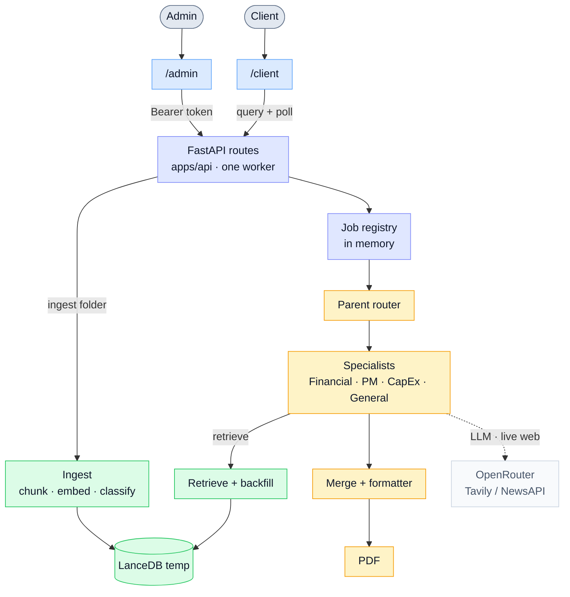
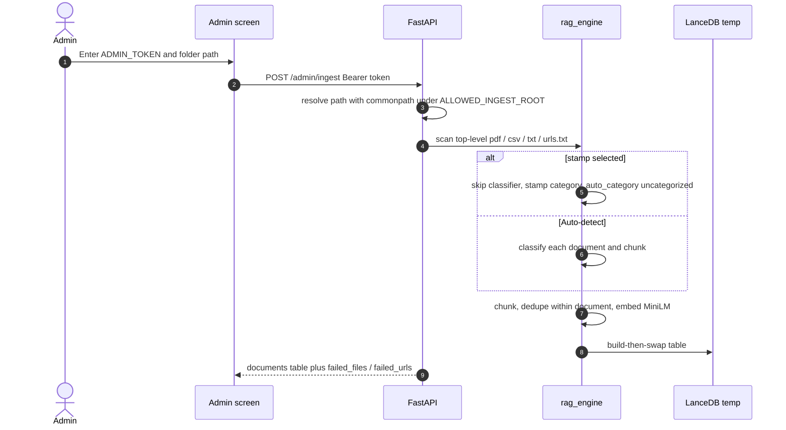
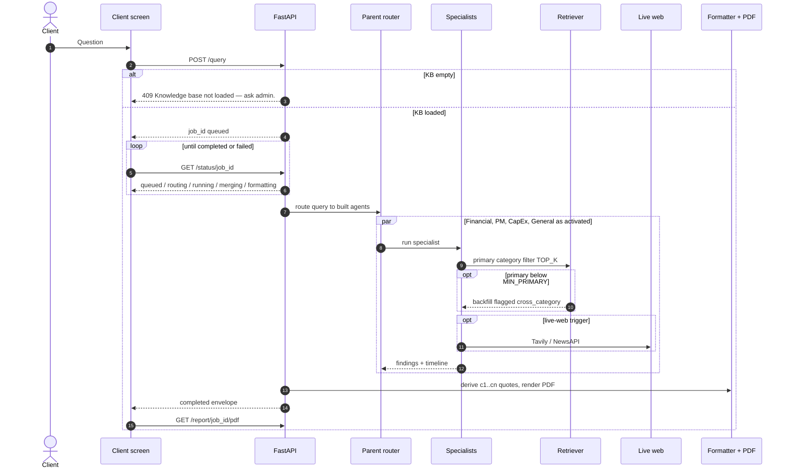

# Pactlify

Admin loads a shared document folder into an in-memory knowledge base. Clients ask a question. A parent agent routes to specialists (Financial, PM, CapEx, General). Agents retrieve from the corpus, optionally search the live web, and return a cited answer plus a PDF.

You need **two processes**: the FastAPI backend and the Vite frontend — or one combined container that serves both (see [Packaging](#7-packaging)).

## Architecture

One React app talks to a single-worker FastAPI process. FastAPI is thin glue. Retrieval lives in `rag_engine`. Routing, specialists, merge, and PDF live in `agent_builder`. The vector store is an in-process LanceDB temp directory and is discarded when the API stops.



Colour marks the owner: blue is the React UI, indigo `apps/api`, amber `agent_builder`, green `rag_engine`, grey the external services. The left branch is admin ingest; the right branch is a client question. `/` and `/app` are entry screens for the same app and are omitted above. Dotted lines are optional calls; LangSmith tracing attaches to the same agent path when enabled.


The client downloads the report with `GET /report/{job_id}/pdf` (WeasyPrint, ReportLab fallback). Activation order is always **financial → pm → capex → general**. Live web runs only on the **primary** (in-category) hit count: Financial / PM / CapEx when `primary_count == 0`; General when primary is thin or the question needs current info.

### Data flow — ingest



Inside Docker, the sample folder path is **`/app/sample_data`** (not your laptop path).

### Data flow — ask a question



## Prerequisites

- Python **3.11 or 3.12** (not Anaconda Python 3.13 — `torch` will not install)
- Node.js **18+** (Node 20 or 22 recommended; Node 21 works with the pinned Vite 6)
- Two terminals, both starting from this directory: `outskillai/`
- Optional: **Docker Desktop** for the three packaged images in [§7](#7-packaging)

Confirm you are in the right folder:

```bash
pwd
# .../outskillai
ls sample_data
# budget.csv  charter.pdf  mixed_brief.pdf  risks.txt  urls.txt
```

---

## 1. Backend

All commands below start from `outskillai/`. Interactive docs: [http://localhost:8000/docs](http://localhost:8000/docs). Full curl examples: [§2](#2-api-endpoints).

### 1.1 Create `.env`

```bash
cp .env.example .env
```

Edit `.env` and set at least:

```
ADMIN_TOKEN=changeme
ALLOWED_INGEST_ROOT=/absolute/path/to/outskillai
```

`ALLOWED_INGEST_ROOT` must be an **absolute path** to this repo folder (or any parent of `sample_data`). A prefix match is not enough; a path like `/allowed-evil` against `/allowed` is rejected.

For real answers (not just UI wiring), also set:

```
OPENROUTER_API_KEY=...
OPENROUTER_MODEL=openai/gpt-4o-mini
```

Optional: `TAVILY_API_KEY` / `NEWSAPI_API_KEY` for live web when RAG is empty or thin.

### 1.2 Install and start the API

Use **Python 3.11 or 3.12**, not Anaconda Python 3.13. If your prompt shows `(base)`, run `conda deactivate` first — that interpreter cannot install `torch` (needed by `sentence-transformers`), so FastAPI never lands and bare `uvicorn` fails with `No module named 'fastapi'`.

First time:

```bash
conda deactivate   # skip if conda is not active
python3.12 -m venv .venv
source .venv/bin/activate
python -m pip install -r requirements-dev.txt
python -m pip install --no-deps -e .
python -m uvicorn apps.api.main:app --workers 1 --host 127.0.0.1 --port 8000
```

Every later start (venv already exists):

```bash
conda deactivate
source .venv/bin/activate
python -m uvicorn apps.api.main:app --workers 1 --host 127.0.0.1 --port 8000
```

Always start the API with `python -m uvicorn` from the venv. A global `uvicorn` on PATH (especially Anaconda's) will not see these packages.

`requirements.txt` is the pinned runtime set; `pyproject.toml` uses the same pins. `requirements-dev.txt` adds pytest. The editable install (`-e .`) is still required so `apps`, `backend`, and `shared` import. Docker images install `requirements.txt` then `pip install --no-deps -e .` so the editable step cannot re-resolve versions.

Use **one worker**. The knowledge base and job registry live in that process. `--reload` or `--workers 2` will look like a random empty KB.

The API listens on **http://127.0.0.1:8000**. Leave this process running while you use the UI or curl.

### 1.3 Confirm the server is up

In another terminal (venv not required for curl):

```bash
curl -sS http://127.0.0.1:8000/kb
# {"loaded":false,"document_count":0}

curl -sS -o /dev/null -w '%{http_code}\n' http://127.0.0.1:8000/openapi.json
# 200
```

If you get `No module named 'fastapi'`, you ran Anaconda's `uvicorn`. Stop it and use `source .venv/bin/activate` then `python -m uvicorn …`.

### 1.4 Tests

Activate the same venv. Pytest uses `TestClient` — it does **not** need uvicorn running.

```bash
source .venv/bin/activate

# Full backend suite
python -m pytest -q

# HTTP contract only (auth, ingest, query, status, PDF)
python -m pytest tests/test_api.py -q

# Ingest sample_data with a fake embedder (no OpenRouter, no MiniLM download)
python -m scripts.smoke_ingest
```

Expect pytest to print a green pass count (currently 100+ tests). Smoke ingest prints document/chunk counts for `sample_data`.

---

## 2. API endpoints

Base URL: `http://127.0.0.1:8000`. JSON request/response unless noted. Errors look like:

```json
{ "error": "kb_empty", "message": "Knowledge base not loaded — ask admin." }
```

Admin routes need:

```
Authorization: Bearer <ADMIN_TOKEN>
```

Omit `category` (or send `null`) on ingest for auto-detect. Do **not** stamp `"uncategorized"`. Allowed stamps / PATCH values: `financial`, `pm`, `capex`, `policy`. PATCH `category: null` unmarks the document (`category` becomes `uncategorized`, `overridden: true`).

Set these once in the curl terminal:

```bash
API=http://127.0.0.1:8000
TOKEN=changeme
ROOT="$(pwd)"   # must be .../outskillai
```

| Method | Path | Auth | Purpose |
|---|---|---|---|
| `GET` | `/kb` | no | Whether the in-memory KB is loaded |
| `GET` | `/admin/status` | Bearer | Folder, counts, ingest failures |
| `GET` | `/admin/documents` | Bearer | Document table |
| `POST` | `/admin/ingest` | Bearer | Scan a folder and replace the KB |
| `PATCH` | `/admin/documents/{document_id}` | Bearer | Override or unmark a category |
| `POST` | `/query` | no | Enqueue a question (needs a loaded KB) |
| `GET` | `/status/{job_id}` | no | Poll job + final envelope |
| `GET` | `/report/{job_id}/pdf` | no | Download the Pactlify PDF |
| `GET` | `/docs` | no | Swagger UI |
| `GET` | `/openapi.json` | no | OpenAPI spec |

Job `status` is one of: `queued`, `routing`, `running`, `merging`, `formatting`, `completed`, `failed`.

Document ids in the JSON samples below are illustrative — copy real ids from `GET /admin/documents` after ingest.

### `GET /kb`

Public. No folder path or filenames.

```bash
curl -sS "$API/kb"
```

Empty:

```json
{ "loaded": false, "document_count": 0 }
```

After ingest:

```json
{ "loaded": true, "document_count": 5 }
```

### `GET /admin/status`

```bash
curl -sS "$API/admin/status" -H "Authorization: Bearer $TOKEN"
```

```json
{
  "loaded": true,
  "last_folder": "/absolute/path/to/outskillai/sample_data",
  "document_count": 5,
  "chunk_count": 14,
  "failed_files": [{ "name": "bad.pdf", "reason": "unreadable" }],
  "failed_urls": [{ "url": "https://example.invalid", "reason": "timeout" }]
}
```

`failed_files` / `failed_urls` are `[]` when ingest is clean. Missing or wrong token → **401** `{ "error": "unauthorized", "message": "Missing or wrong admin token." }`.

### `GET /admin/documents`

```bash
curl -sS "$API/admin/documents" -H "Authorization: Bearer $TOKEN"
```

Empty KB: `{ "documents": [] }`. Loaded:

```json
{
  "documents": [
    {
      "document_id": "doc_charter",
      "source": "charter.pdf",
      "type": "pdf",
      "chunk_count": 3,
      "auto_category": "pm",
      "category": "pm",
      "overridden": false
    }
  ]
}
```

`type` is `pdf` | `csv` | `txt` | `web`. `category` / `auto_category` are `financial` | `pm` | `capex` | `policy` | `uncategorized`.

### `POST /admin/ingest`

Synchronous. First MiniLM load can take a minute. Replaces the whole KB on success; a rejected folder does **not** swap.

Auto-detect (recommended for `sample_data`):

```bash
curl -sS "$API/admin/ingest" \
  -H "Authorization: Bearer $TOKEN" \
  -H "Content-Type: application/json" \
  -d "{\"folder_path\": \"$ROOT/sample_data\"}"
```

Stamp every file in the folder as financial (classifier skipped; `auto_category` stays `uncategorized`):

```bash
curl -sS "$API/admin/ingest" \
  -H "Authorization: Bearer $TOKEN" \
  -H "Content-Type: application/json" \
  -d "{\"folder_path\": \"$ROOT/sample_data\", \"category\": \"financial\"}"
```

Success **200**:

```json
{
  "knowledge_base_id": "shared",
  "documents": [
    {
      "document_id": "doc_mixed_brief",
      "source": "mixed_brief.pdf",
      "type": "pdf",
      "chunk_count": 4,
      "auto_category": "financial",
      "category": "financial",
      "overridden": false
    }
  ],
  "failed_files": [],
  "failed_urls": [],
  "chunk_count": 14
}
```

| Status | `error` | When |
|---|---|---|
| 401 | `unauthorized` | Missing/wrong Bearer token |
| 400 | `bad_folder` | Missing folder, not a directory, empty (no top-level pdf/csv/txt/`urls.txt`), stamp `"uncategorized"`, invalid stamp |
| 403 | `forbidden_path` | Path is outside `ALLOWED_INGEST_ROOT` |

Scan is **top-level files only**. Inside Docker use `folder_path: "/app/sample_data"`.

### `PATCH /admin/documents/{document_id}`

```bash
# Override
curl -sS -X PATCH "$API/admin/documents/doc_charter" \
  -H "Authorization: Bearer $TOKEN" \
  -H "Content-Type: application/json" \
  -d '{"category": "pm"}'

# Unmark (category becomes uncategorized, auto_category unchanged)
curl -sS -X PATCH "$API/admin/documents/doc_charter" \
  -H "Authorization: Bearer $TOKEN" \
  -H "Content-Type: application/json" \
  -d '{"category": null}'
```

Success **200**:

```json
{
  "ok": true,
  "document": {
    "document_id": "doc_charter",
    "source": "charter.pdf",
    "type": "pdf",
    "chunk_count": 3,
    "auto_category": "pm",
    "category": "uncategorized",
    "overridden": true
  }
}
```

Unknown id → **404** `{ "error": "not_found" }`. Invalid category string → **400** `{ "error": "bad_request" }`.

### `POST /query`

Returns immediately with a `job_id`. Work runs in the background.

```bash
curl -sS "$API/query" \
  -H "Content-Type: application/json" \
  -d '{"query": "What is the project timeline and the financial impact of the Q1 budget?"}'
```

```json
{ "job_id": "job_a1b2c3d4e5f6" }
```

| Status | `error` | When |
|---|---|---|
| 400 | `empty_query` | Blank / whitespace-only `query` |
| 409 | `kb_empty` | No successful ingest yet — `"Knowledge base not loaded — ask admin."` |

Needs `OPENROUTER_API_KEY` for a real answer. Without it the job typically ends `failed`.

### `GET /status/{job_id}`

Poll until `completed` or `failed`. Jobs are in-process: restarting the API forgets them (**404** `job_not_found`).

```bash
JOB=job_a1b2c3d4e5f6
curl -sS "$API/status/$JOB"
```

Queued:

```json
{
  "job_id": "job_a1b2c3d4e5f6",
  "status": "queued",
  "query": "What is the project timeline and the financial impact of the Q1 budget?",
  "created_at": "2026-09-05T16:00:00+00:00",
  "activated_agents": [],
  "timeline": [],
  "warnings": [],
  "error": null,
  "result": null
}
```

Completed (shape abbreviated):

```json
{
  "job_id": "job_a1b2c3d4e5f6",
  "status": "completed",
  "query": "What is the project timeline and the financial impact of the Q1 budget?",
  "created_at": "2026-09-05T16:00:00+00:00",
  "activated_agents": ["financial", "pm"],
  "timeline": [
    {
      "agent": "financial",
      "status": "done",
      "chunks_retrieved": 4,
      "primary_count": 4,
      "used_live_web": false,
      "error": null
    }
  ],
  "warnings": [],
  "error": null,
  "result": {
    "job_id": "job_a1b2c3d4e5f6",
    "query": "What is the project timeline and the financial impact of the Q1 budget?",
    "activated_agents": ["financial", "pm"],
    "answer": {
      "summary": "…",
      "sections": [
        {
          "agent": "financial",
          "title": "Financial",
          "body": "…",
          "key_points": ["East Q1 over budget"],
          "citation_ids": ["c1"]
        }
      ]
    },
    "citations": [
      {
        "id": "c1",
        "source": "budget.csv",
        "type": "csv",
        "category": "financial",
        "page": null,
        "row_start": 1,
        "row_end": 2,
        "cross_category": false,
        "quote": "region,quarter,revenue,budget\neast,Q1,10,12"
      }
    ],
    "warnings": [],
    "pdf_available": true
  }
}
```

Failed job: `status: "failed"`, `error` set, `result: null`. Unknown or expired id → **404** `{ "error": "job_not_found", "message": "Job no longer available — please ask again." }`.

One-shot poll loop:

```bash
JOB=$(curl -sS "$API/query" -H "Content-Type: application/json" \
  -d '{"query": "What are the key milestones and schedule risks?"}' | python -c "import sys,json; print(json.load(sys.stdin)['job_id'])")
while true; do
  STATUS=$(curl -sS "$API/status/$JOB")
  echo "$STATUS" | python -c "import sys,json; print(json.load(sys.stdin)['status'])"
  echo "$STATUS" | python -c "import sys,json; s=json.load(sys.stdin)['status']; raise SystemExit(0 if s in ('completed','failed') else 1)" && break
  sleep 2
done
```

### `GET /report/{job_id}/pdf`

Only when the job is `completed` and `result.pdf_available` is `true`. Body is raw PDF (`Content-Type: application/pdf`).

```bash
curl -sS "$API/report/$JOB/pdf" -o "pactlify-$JOB.pdf"
file "pactlify-$JOB.pdf"
# PDF document
```

Not ready / missing → **404** `{ "error": "pdf_not_ready" }` or `job_not_found`.

### Live round-trip (ingest → ask → PDF)

Requires a running API, a loaded `.env`, and `OPENROUTER_API_KEY` for a completed answer.

```bash
curl -sS "$API/admin/ingest" \
  -H "Authorization: Bearer $TOKEN" \
  -H "Content-Type: application/json" \
  -d "{\"folder_path\": \"$ROOT/sample_data\"}"

curl -sS "$API/kb"
```

Then `POST /query`, poll `GET /status/{job_id}`, and `GET /report/{job_id}/pdf` as above.

---

## 3. Frontend

Open a **second** terminal in `outskillai/`:

```bash
cd frontend
cp .env.example .env
npm install
npm run dev
```

Vite serves **http://localhost:5173**.

`frontend/.env` should keep:

```
VITE_API_BASE_URL=http://localhost:8000
```

Do **not** put `ADMIN_TOKEN` or OpenRouter keys in the frontend env. The Admin screen prompts for the token and holds it in memory for the tab.

Optional: `VITE_USE_FIXTURES=true` runs the UI against `src/fixtures` with no API. Leave this unset for a real demo.

---

## 4. Sample walkthrough

Use two browser tabs if you like, or the **Admin | Client** toggle in the header. Wordmark **Pactlify** returns to the constellation landing at `/`. **Start building** opens `/app`. The same ingest → query → PDF path over HTTP is in [§2](#2-api-endpoints).

### A. Marketing, then mosaic hub

1. Open http://localhost:5173 — constellation hero (pale canvas, lime **Start building**, drifting node network). Headline is smaller **Ask the** over **Corpus.** Pipeline: Client → UI Interface → Multi-Agent Worker → Tools → RAG Engine → Response and Report. No Admin | Client header.
2. Click **Start building**. You land on `/app`: mosaic hub, four agent tiles (Financial, PM, CapEx, General) that do **not** navigate, and a status chip `KB empty`
3. Click **Load documents** (or toggle **Admin**)

### B. Load the sample folder

1. When prompted, enter the same token as `ADMIN_TOKEN` in `.env` (`changeme` if you kept the example)
2. Leave category cards on **Auto-detect / unmarked** (do not send `"uncategorized"`)
3. Folder path — paste the absolute path to the sample corpus:

```text
/absolute/path/to/outskillai/sample_data
```

4. Click **Submit**. Wait for the spinner (ingest is synchronous; first MiniLM load can take a bit)
5. The table should list id / name / category for `mixed_brief.pdf`, `charter.pdf`, `budget.csv`, `risks.txt`, and the URL from `urls.txt`
6. Header chip should become `KB loaded · N docs`
7. Failures, if any, appear **under** the table, not as success rows

If Submit fails:

| Symptom | Likely cause |
|---|---|
| 401 / token prompt again | Token does not match `ADMIN_TOKEN` |
| Path is outside `ALLOWED_INGEST_ROOT` | Path is not under the absolute root in `.env` |
| Folder empty / missing | Path is wrong, or you pointed at a subdirectory-only folder (scan is **top-level files only**) |

### C. Ask a question

1. Toggle **Client** (or go back to `/app` and click **Ask the corpus**)
2. Confirm **Ask** is enabled. If it is disabled, the KB is not loaded — load documents in Admin first
3. Type a question that should hit both finance and timeline, for example:

```text
What is the project timeline and the financial impact of the Q1 budget?
```

4. Click **Ask**. The question text stays in the field
5. Open the **Timeline** tab while the job is running (`QUEUED` → `ROUTING` → `RUNNING` → …). Chrome chip shows `Job running` on `/app`, `/client`, and `/admin` until the job finishes
6. Switch to **Answer**. You should see a summary, agent sections, and citation chips like `[c1]`
7. Click a chip — **Sources** should open and highlight that row. A `CROSS` badge means the chunk was backfilled from outside that agent’s category
8. If **Download PDF** is enabled, click it. The file should save as `pactlify-{job_id}.pdf`

Other questions to try against `sample_data`:

```text
What are the key milestones and schedule risks?
What is the east region Q1 revenue versus budget?
What capital investments or depreciation are mentioned?
```

### D. Restart behavior

The vector store is in-memory. If you stop the API process:

1. `GET /kb` goes back to `loaded: false`
2. Reload Admin — table should show *No documents loaded.*
3. Client **Ask** is disabled again with *Knowledge base not loaded — ask admin.*
4. An old job id in the URL/poll shows *Job no longer available — please ask again.*

Load `sample_data` again after every API restart.

---

## 5. LangSmith observability

Tracing is **optional**. If LangSmith is down or misconfigured, queries must still complete. Keys stay in the **backend** `.env` only — never in the frontend.

LangGraph records the parent router and specialist nodes when tracing is on. OpenRouter calls go through a raw HTTP wrapper, so you may see graph/node spans without a separate “LLM provider” row for every model call.

The compiled graph that Studio and `langgraph dev` load is `backend/agent_builder/studio.py:graph` (all four specialists). The CLI config is `langgraph.json` at this directory root.

### 5.1 Create a LangSmith project

1. Open [https://smith.langchain.com](https://smith.langchain.com) and sign in.
2. Create an API key (**Settings → API Keys**). It looks like `lsv2_pt_…`.
3. Create a project, or skip this and let the first trace create `pactlify` from the env var below.

### 5.2 Add keys to backend `.env`

In `outskillai/.env` (not `frontend/.env`):

```
LANGSMITH_TRACING=true
LANGSMITH_API_KEY=lsv2_pt_your_key_here
LANGSMITH_PROJECT=pactlify
```

Legacy names still work if you already use them:

```
LANGCHAIN_TRACING_V2=true
LANGCHAIN_API_KEY=lsv2_pt_your_key_here
LANGCHAIN_PROJECT=pactlify
```

EU (or other non-US) workspaces also need:

```
LANGSMITH_ENDPOINT=https://eu.api.smith.langchain.com
```

Leave `LANGSMITH_TRACING=false` (and `LANGCHAIN_TRACING_V2=false`) if you do not want traces.

### 5.3 Confirm tracing env and validate the graph config

Env is read at process start (`load_dotenv()` in `apps/api/main.py`). From `outskillai/`:

```bash
source .venv/bin/activate
python -c "from dotenv import load_dotenv; load_dotenv(); import os; print(os.getenv('LANGSMITH_TRACING') or os.getenv('LANGCHAIN_TRACING_V2'))"
# true
```

`langgraph.json` must exist in this directory (it is committed). Validate it:

```bash
langgraph validate
# Configuration file .../langgraph.json is valid. (1 graph found)
```

If `langgraph` is missing:

```bash
python -m pip install "langgraph-cli[inmem]"
```

The file points at one compiled graph:

```json
{
  "python_version": "3.12",
  "dependencies": ["."],
  "graphs": {
    "pactlify": "./backend/agent_builder/studio.py:graph"
  },
  "env": ".env"
}
```

`--allow-blocking` is required: specialists retrieve and call OpenRouter synchronously.

### 5.4 Run LangGraph Studio (`langgraph dev`)

This is the local observation server. It reads `langgraph.json` + `.env` and opens Studio against project `pactlify`.

```bash
source .venv/bin/activate
langgraph dev --allow-blocking
```

Default listen: **http://127.0.0.1:2024**. Studio UI: [https://smith.langchain.com/studio](https://smith.langchain.com/studio) (it attaches to that local server). Skip the auto-open with `--no-browser`.

In Studio, select graph **pactlify**. Input:

```json
{
  "query": "What is the project timeline and the financial impact of the Q1 budget?"
}
```

Specialists need a loaded KB (`handle`). Studio-only runs without ingest still trace `route` / specialist nodes; retrieve then fails and the node records a warning. For a full retrieve → merge trace, ingest `sample_data` through the FastAPI Admin first (same process memory is **not** shared with `langgraph dev`). Studio observation is the graph itself; FastAPI observation is §5.5.

### 5.5 Generate a trace from the FastAPI app

1. Restart uvicorn after editing `.env` (env is not hot-reloaded):

```bash
source .venv/bin/activate
python -m uvicorn apps.api.main:app --workers 1 --host 127.0.0.1 --port 8000
```

2. Keep the frontend on http://localhost:5173 and the API on http://localhost:8000.
3. Load `sample_data` in Admin if the KB is empty.
4. On Client, ask:

```text
What is the project timeline and the financial impact of the Q1 budget?
```

5. Wait until the job is `COMPLETED` (or `FAILED` — failed runs still trace).

### 5.6 Find it in LangSmith

1. Open [https://smith.langchain.com](https://smith.langchain.com).
2. Select project **pactlify** (or `LANGSMITH_PROJECT`).
3. Open the newest run. You should see the LangGraph path: `route` → specialist nodes (`financial` / `pm` / `capex` / `general`) → `merge`.
4. Click a node for inputs/outputs and timing.

### 5.7 If you see nothing

| Check | What to do |
|---|---|
| Tracing still `false` | Set `LANGSMITH_TRACING=true` (or `LANGCHAIN_TRACING_V2=true`) and **restart** uvicorn / `langgraph dev` |
| `langgraph.json` missing | File must live in `outskillai/` next to `pyproject.toml`. Run `langgraph validate` |
| `langgraph: command not found` | `python -m pip install "langgraph-cli[inmem]"` |
| `Path 'langgraph.json' does not exist` | `cd` to `outskillai/` before `langgraph dev` |
| Wrong file | Keys must be in `outskillai/.env`, not `frontend/.env` |
| No API key | `LANGSMITH_API_KEY` or `LANGCHAIN_API_KEY` must be set |
| Region | Set `LANGSMITH_ENDPOINT` for EU/other regions |
| No Client job | Ingest + Ask must actually run the graph (empty KB never traces a query from the UI) |
| Project filter | In the UI, select the same name as `LANGSMITH_PROJECT` |

Tracing must never block an answer. If LangSmith is unreachable, the job still finishes in the UI.

---

## 6. Extra checks (optional)

Backend pytest and smoke ingest are in [§1.4](#14-tests). Frontend typecheck:

```bash
cd frontend
npx tsc --noEmit
```

---

## 7. Packaging

Three Docker packages. Build them from this directory (`outskillai/`). Copy `.env.example` to `.env` first (backend and combined need it). First backend/combined build downloads MiniLM and PyTorch — expect several minutes. Both API images copy `langgraph.json` so the Studio graph id `pactlify` is in the image; set `LANGSMITH_TRACING=true` and `LANGSMITH_API_KEY` in `.env` to send traces from the running container.

In Admin, the sample corpus path inside a container is:

```text
/app/sample_data
```

### 7.1 Backend only

API on **http://localhost:8000**. Pair with local `npm run dev` or the frontend image.

```bash
docker compose -f docker-compose.backend.yml up --build
```

Equivalent:

```bash
docker build -f Dockerfile.backend -t pactlify-backend:0.6.0 .
docker run --rm --env-file .env -e ALLOWED_INGEST_ROOT=/app \
  -e CORS_ORIGIN=http://localhost:5173 \
  -p 8000:8000 pactlify-backend:0.6.0
```

Still **one worker**. The KB dies when the container stops.

### 7.2 Frontend only

Static UI on **http://localhost:5173**. Needs an API already on http://localhost:8000 (`VITE_API_BASE_URL` is baked in at image build).

```bash
docker compose -f docker-compose.frontend.yml up --build
```

Equivalent:

```bash
docker build -f frontend/Dockerfile -t pactlify-frontend:0.6.0 \
  --build-arg VITE_API_BASE_URL=http://localhost:8000 .
docker run --rm -p 5173:80 pactlify-frontend:0.6.0
```

### 7.3 Combined frontend and backend

One container: FastAPI serves the built UI and the API on **http://localhost:8000**.

```bash
docker compose up --build
```

Equivalent:

```bash
docker build -f Dockerfile.combined -t pactlify:0.6.0 .
docker run --rm --env-file .env -e ALLOWED_INGEST_ROOT=/app \
  -e CORS_ORIGIN=http://localhost:8000 -e STATIC_DIR=/app/ui \
  -p 8000:8000 pactlify:0.6.0
```

Open http://localhost:8000 — constellation `/`, mosaic `/app`, `/client`, and `/admin` are the same app. No second process.

| Package | Image | Listen | UI | API |
|---|---|---|---|---|
| Backend | `pactlify-backend:0.6.0` | `:8000` | no | yes |
| Frontend | `pactlify-frontend:0.6.0` | `:5173` → nginx `:80` | yes | talks to host `:8000` |
| Combined | `pactlify:0.6.0` | `:8000` | yes | yes, same origin |

### 7.4 Local build package (and Vercel)

Build the Vite UI into `frontend/dist`. FastAPI serves it automatically when that folder exists (or when `STATIC_DIR` is set).

```bash
chmod +x scripts/build_package.sh
./scripts/build_package.sh
source .venv/bin/activate
STATIC_DIR="$(pwd)/frontend/dist" \
  python -m uvicorn apps.api.main:app --workers 1 --host 127.0.0.1 --port 8000
```

Vercel: `vercel.json` is current FastAPI config (no legacy `builds` / `routes`). `pyproject.toml` sets `tool.vercel.entrypoint` to `apps.api.main:app` and a frontend `npm run build` as the Vercel build script. From this directory, after `vercel link`:

```bash
npx vercel
```

Set at least `ADMIN_TOKEN`, `ALLOWED_INGEST_ROOT`, `OPENROUTER_API_KEY`, and (for traces) `LANGSMITH_TRACING` / `LANGSMITH_API_KEY` in the Vercel project env. The in-memory KB and MiniLM/PyTorch payload are a poor fit for a cold-start function — prefer the combined Docker image for a demo. Job timeout is 300s on the FastAPI function.

---

## Sample corpus

Top-level files only (subdirectories are not scanned):

| File | What it is for |
|---|---|
| `mixed_brief.pdf` | One document with a **budget** page and a **timeline** page |
| `charter.pdf` | Project charter / milestones |
| `budget.csv` | Region / quarter revenue and budget |
| `risks.txt` | Schedule and resource risk |
| `urls.txt` | Ingested web URL |

---

## Environment reference

Backend `.env` (from `.env.example`):

| Variable | Required for demo | Notes |
|---|---|---|
| `ADMIN_TOKEN` | yes | Typed into the Admin prompt |
| `ALLOWED_INGEST_ROOT` | yes | Absolute path; must contain `sample_data`. In Docker this is `/app` |
| `CORS_ORIGIN` | no | Comma-separated. Default `http://localhost:5173`. Combined image uses `http://localhost:8000` |
| `STATIC_DIR` | combined Docker only | Directory of the Vite `dist` (image default `/app/ui`) |
| `OPENROUTER_API_KEY` | for real answers | Routing + specialist synthesis |
| `OPENROUTER_MODEL` | no | Default `openai/gpt-4o-mini` |
| `TAVILY_API_KEY` / `NEWSAPI_API_KEY` | no | Live web |
| `LANGSMITH_TRACING` / `LANGCHAIN_TRACING_V2` | no | `true` to send LangGraph traces (`langgraph.json` + FastAPI) |
| `LANGSMITH_API_KEY` / `LANGCHAIN_API_KEY` | for tracing | LangSmith API key (`lsv2_pt_…`) |
| `LANGSMITH_PROJECT` / `LANGCHAIN_PROJECT` | no | Default in `.env.example`: `pactlify` |
| `LANGSMITH_ENDPOINT` | no | Only if your LangSmith workspace is not US |
| `EMBEDDING_MODEL` | no | Default `sentence-transformers/all-MiniLM-L6-v2` |

Frontend `.env`: only `VITE_API_BASE_URL` (and optional `VITE_USE_FIXTURES`).
