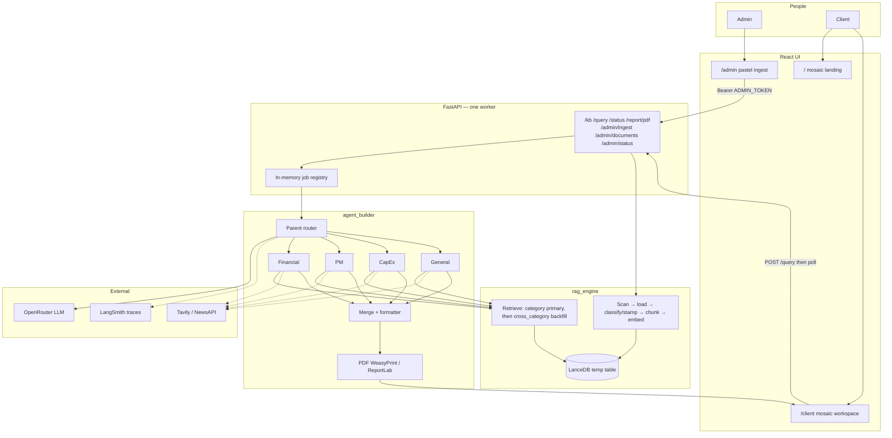
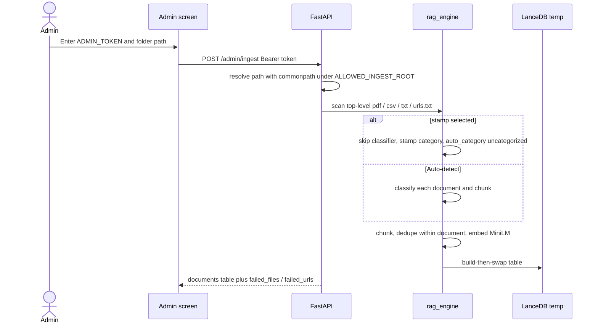
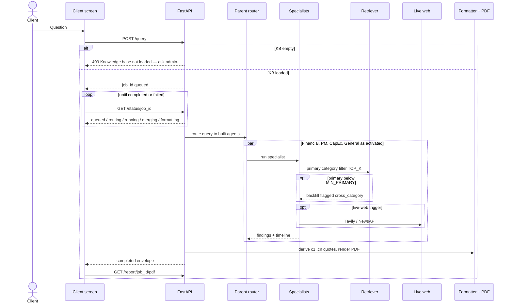

# Pactlify

Admin loads a shared document folder into an in-memory knowledge base. Clients ask a question. A parent agent routes to specialists (Financial, PM, CapEx, General). Agents retrieve from the corpus, optionally search the live web, and return a cited answer plus a PDF.

You need **two processes**: the FastAPI backend and the Vite frontend — or one combined container that serves both (see [Packaging](#6-packaging)).

## Architecture

One React app talks to a single-worker FastAPI process. FastAPI is thin glue. Retrieval lives in `rag_engine`. Routing, specialists, merge, and PDF live in `agent_builder`. The vector store is an in-process LanceDB temp directory and is discarded when the API stops.



Activation order is always **financial → pm → capex → general**. Live web runs only on the **primary** (in-category) hit count: Financial / PM / CapEx when `primary_count == 0`; General when primary is thin or the question needs current info.

### Data flow — ingest



Inside Docker, the sample folder path is **`/app/sample_data`** (not your laptop path).

### Data flow — ask a question



## Prerequisites

- Python **3.11+**
- Node.js **18+** (Node 20 or 22 recommended; Node 21 works with the pinned Vite 6)
- Two terminals, both starting from this directory: `outskillai/`
- Optional: **Docker Desktop** for the three packaged images in [§6](#6-packaging)

Confirm you are in the right folder:

```bash
pwd
# .../outskillai
ls sample_data
# budget.csv  charter.pdf  mixed_brief.pdf  risks.txt  urls.txt
```

---

## 1. Backend

### 1.1 Create `.env`

```bash
cp .env.example .env
```

Edit `.env` and set at least:

```
ADMIN_TOKEN=changeme
ALLOWED_INGEST_ROOT=/absolute/path/to/outskillai
```

`ALLOWED_INGEST_ROOT` must be an **absolute path** to this repo folder (or any parent of `sample_data`). A prefix match is not enough; a path like `/allowed-evil` against `/allowed` is rejected.

For real answers (not just UI wiring), also set:

```
OPENROUTER_API_KEY=...
OPENROUTER_MODEL=openai/gpt-4o-mini
```

Optional: `TAVILY_API_KEY` / `NEWSAPI_API_KEY` for live web when RAG is empty or thin.

### 1.2 Install and start the API

```bash
python3 -m pip install -r requirements-dev.txt
python3 -m pip install -e .
uvicorn apps.api.main:app --workers 1
```

`requirements.txt` is runtime only; `requirements-dev.txt` adds pytest. The editable install (`-e .`) is still required so `apps`, `packages`, and `shared` import.

Use **one worker**. The knowledge base and job registry live in that process. `--reload` or `--workers 2` will look like a random empty KB.

The API listens on **http://localhost:8000**.

Quick check in a third terminal:

```bash
curl -s http://localhost:8000/kb
# {"loaded":false,"document_count":0}
```

Leave this server running.

---

## 2. Frontend

Open a **second** terminal in `outskillai/`:

```bash
cd frontend
cp .env.example .env
npm install
npm run dev
```

Vite serves **http://localhost:5173**.

`frontend/.env` should keep:

```
VITE_API_BASE_URL=http://localhost:8000
```

Do **not** put `ADMIN_TOKEN` or OpenRouter keys in the frontend env. The Admin screen prompts for the token and holds it in memory for the tab.

Optional: `VITE_USE_FIXTURES=true` runs the UI against `src/fixtures` with no API. Leave this unset for a real demo.

---

## 3. Sample walkthrough

Use two browser tabs if you like, or the **Admin | Client** toggle in the header. Wordmark **Pactlify** returns to `/`.

### A. Landing

1. Open http://localhost:5173
2. You should see mosaic landing, four agent tiles (Financial, PM, CapEx, General) that do **not** navigate, and a status chip `KB empty`
3. Click **Load documents** (or toggle **Admin**)

### B. Load the sample folder

1. When prompted, enter the same token as `ADMIN_TOKEN` in `.env` (`changeme` if you kept the example)
2. Leave category cards on **Auto-detect / unmarked** (do not send `"uncategorized"`)
3. Folder path — paste the absolute path to the sample corpus:

```text
/absolute/path/to/outskillai/sample_data
```

4. Click **Submit**. Wait for the spinner (ingest is synchronous; first MiniLM load can take a bit)
5. The table should list id / name / category for `mixed_brief.pdf`, `charter.pdf`, `budget.csv`, `risks.txt`, and the URL from `urls.txt`
6. Header chip should become `KB loaded · N docs`
7. Failures, if any, appear **under** the table, not as success rows

If Submit fails:

| Symptom | Likely cause |
|---|---|
| 401 / token prompt again | Token does not match `ADMIN_TOKEN` |
| Path is outside `ALLOWED_INGEST_ROOT` | Path is not under the absolute root in `.env` |
| Folder empty / missing | Path is wrong, or you pointed at a subdirectory-only folder (scan is **top-level files only**) |

### C. Ask a question

1. Toggle **Client** (or go back to `/` and click **Ask the corpus**)
2. Confirm **Ask** is enabled. If it is disabled, the KB is not loaded — load documents in Admin first
3. Type a question that should hit both finance and timeline, for example:

```text
What is the project timeline and the financial impact of the Q1 budget?
```

4. Click **Ask**. The question text stays in the field
5. Open the **Timeline** tab while the job is running (`QUEUED` → `ROUTING` → `RUNNING` → …). Chrome chip shows `Job running` on every page until the job finishes
6. Switch to **Answer**. You should see a summary, agent sections, and citation chips like `[c1]`
7. Click a chip — **Sources** should open and highlight that row. A `CROSS` badge means the chunk was backfilled from outside that agent’s category
8. If **Download PDF** is enabled, click it. The file should save as `pactlify-{job_id}.pdf`

Other questions to try against `sample_data`:

```text
What are the key milestones and schedule risks?
What is the east region Q1 revenue versus budget?
What capital investments or depreciation are mentioned?
```

### D. Restart behavior

The vector store is in-memory. If you stop the API process:

1. `GET /kb` goes back to `loaded: false`
2. Reload Admin — table should show *No documents loaded.*
3. Client **Ask** is disabled again with *Knowledge base not loaded — ask admin.*
4. An old job id in the URL/poll shows *Job no longer available — please ask again.*

Load `sample_data` again after every API restart.

---

## 4. LangSmith observability

Tracing is **optional**. If LangSmith is down or misconfigured, queries must still complete. Keys stay in the **backend** `.env` only — never in the frontend.

LangGraph records the parent router and specialist nodes when tracing is on. OpenRouter calls go through a raw HTTP wrapper, so you may see graph/node spans without a separate “LLM provider” row for every model call.

### 4.1 Create a LangSmith project

1. Open [https://smith.langchain.com](https://smith.langchain.com) and sign in.
2. Create an API key (**Settings → API Keys**). It looks like `lsv2_pt_…`.
3. Create a project, or skip this and let the first trace create `pactlify` from the env var below.

### 4.2 Add keys to backend `.env`

In `outskillai/.env` (not `frontend/.env`):

```
LANGSMITH_TRACING=true
LANGSMITH_API_KEY=lsv2_pt_your_key_here
LANGSMITH_PROJECT=pactlify
```

Legacy names still work if you already use them:

```
LANGCHAIN_TRACING_V2=true
LANGCHAIN_API_KEY=lsv2_pt_your_key_here
LANGCHAIN_PROJECT=pactlify
```

EU (or other non-US) workspaces also need:

```
LANGSMITH_ENDPOINT=https://eu.api.smith.langchain.com
```

Leave `LANGSMITH_TRACING=false` (and `LANGCHAIN_TRACING_V2=false`) if you do not want traces.

### 4.3 Restart the API

Env is read at process start (`load_dotenv()` in `apps/api/main.py`). Stop uvicorn and start it again from `outskillai/`:

```bash
uvicorn apps.api.main:app --workers 1
```

Confirm the process can see tracing (should print `true`):

```bash
python3 -c "from dotenv import load_dotenv; load_dotenv(); import os; print(os.getenv('LANGSMITH_TRACING') or os.getenv('LANGCHAIN_TRACING_V2'))"
```

### 4.4 Generate a trace

1. Keep the frontend on http://localhost:5173 and the API on http://localhost:8000.
2. Load `sample_data` in Admin if the KB is empty.
3. On Client, ask:

```text
What is the project timeline and the financial impact of the Q1 budget?
```

4. Wait until the job is `COMPLETED` (or `FAILED` — failed runs still trace).

### 4.5 Find it in LangSmith

1. Open [https://smith.langchain.com](https://smith.langchain.com).
2. Select project **pactlify** (or `LANGSMITH_PROJECT`).
3. Open the newest run. You should see the LangGraph path: `route` → specialist nodes (`financial` / `pm` / …) → `merge`.
4. Click a node for inputs/outputs and timing.

### 4.6 If you see nothing

| Check | What to do |
|---|---|
| Tracing still `false` | Set `LANGSMITH_TRACING=true` (or `LANGCHAIN_TRACING_V2=true`) and **restart** uvicorn |
| Wrong file | Keys must be in `outskillai/.env`, not `frontend/.env` |
| No API key | `LANGSMITH_API_KEY` or `LANGCHAIN_API_KEY` must be set |
| Region | Set `LANGSMITH_ENDPOINT` for EU/other regions |
| No Client job | Ingest + Ask must actually run the graph (empty KB never traces a query) |
| Project filter | In the UI, select the same name as `LANGSMITH_PROJECT` |

Tracing must never block an answer. If LangSmith is unreachable, the job still finishes in the UI.

---

## 5. Extra checks (optional)

Smoke ingest (no UI, fake embedder):

```bash
python3 -m scripts.smoke_ingest
```

Backend tests:

```bash
python3 -m pytest -q
```

Frontend typecheck:

```bash
cd frontend
npx tsc --noEmit
```

---

## 6. Packaging

Three Docker packages. Build them from this directory (`outskillai/`). Copy `.env.example` to `.env` first (backend and combined need it). First backend/combined build downloads MiniLM and PyTorch — expect several minutes.

In Admin, the sample corpus path inside a container is:

```text
/app/sample_data
```

### 6.1 Backend only

API on **http://localhost:8000**. Pair with local `npm run dev` or the frontend image.

```bash
docker compose -f docker-compose.backend.yml up --build
```

Equivalent:

```bash
docker build -f Dockerfile.backend -t pactlify-backend:0.4.0 .
docker run --rm --env-file .env -e ALLOWED_INGEST_ROOT=/app \
  -e CORS_ORIGIN=http://localhost:5173 \
  -p 8000:8000 pactlify-backend:0.4.0
```

Still **one worker**. The KB dies when the container stops.

### 6.2 Frontend only

Static UI on **http://localhost:5173**. Needs an API already on http://localhost:8000 (`VITE_API_BASE_URL` is baked in at image build).

```bash
docker compose -f docker-compose.frontend.yml up --build
```

Equivalent:

```bash
docker build -f frontend/Dockerfile -t pactlify-frontend:0.4.0 \
  --build-arg VITE_API_BASE_URL=http://localhost:8000 .
docker run --rm -p 5173:80 pactlify-frontend:0.4.0
```

### 6.3 Combined frontend and backend

One container: FastAPI serves the built UI and the API on **http://localhost:8000**.

```bash
docker compose up --build
```

Equivalent:

```bash
docker build -f Dockerfile.combined -t pactlify:0.4.0 .
docker run --rm --env-file .env -e ALLOWED_INGEST_ROOT=/app \
  -e CORS_ORIGIN=http://localhost:8000 -e STATIC_DIR=/app/ui \
  -p 8000:8000 pactlify:0.4.0
```

Open http://localhost:8000 — landing, `/client`, and `/admin` are the same app. No second process.

| Package | Image | Listen | UI | API |
|---|---|---|---|---|
| Backend | `pactlify-backend:0.4.0` | `:8000` | no | yes |
| Frontend | `pactlify-frontend:0.4.0` | `:5173` → nginx `:80` | yes | talks to host `:8000` |
| Combined | `pactlify:0.4.0` | `:8000` | yes | yes, same origin |

---

## Sample corpus

Top-level files only (subdirectories are not scanned):

| File | What it is for |
|---|---|
| `mixed_brief.pdf` | One document with a **budget** page and a **timeline** page |
| `charter.pdf` | Project charter / milestones |
| `budget.csv` | Region / quarter revenue and budget |
| `risks.txt` | Schedule and resource risk |
| `urls.txt` | Ingested web URL |

---

## Environment reference

Backend `.env` (from `.env.example`):

| Variable | Required for demo | Notes |
|---|---|---|
| `ADMIN_TOKEN` | yes | Typed into the Admin prompt |
| `ALLOWED_INGEST_ROOT` | yes | Absolute path; must contain `sample_data`. In Docker this is `/app` |
| `CORS_ORIGIN` | no | Comma-separated. Default `http://localhost:5173`. Combined image uses `http://localhost:8000` |
| `STATIC_DIR` | combined Docker only | Directory of the Vite `dist` (image default `/app/ui`) |
| `OPENROUTER_API_KEY` | for real answers | Routing + specialist synthesis |
| `OPENROUTER_MODEL` | no | Default `openai/gpt-4o-mini` |
| `TAVILY_API_KEY` / `NEWSAPI_API_KEY` | no | Live web |
| `LANGSMITH_TRACING` / `LANGCHAIN_TRACING_V2` | no | `true` to send LangGraph traces |
| `LANGSMITH_API_KEY` / `LANGCHAIN_API_KEY` | for tracing | LangSmith API key (`lsv2_pt_…`) |
| `LANGSMITH_PROJECT` / `LANGCHAIN_PROJECT` | no | Default in `.env.example`: `pactlify` |
| `LANGSMITH_ENDPOINT` | no | Only if your LangSmith workspace is not US |
| `EMBEDDING_MODEL` | no | Default `sentence-transformers/all-MiniLM-L6-v2` |

Frontend `.env`: only `VITE_API_BASE_URL` (and optional `VITE_USE_FIXTURES`).
